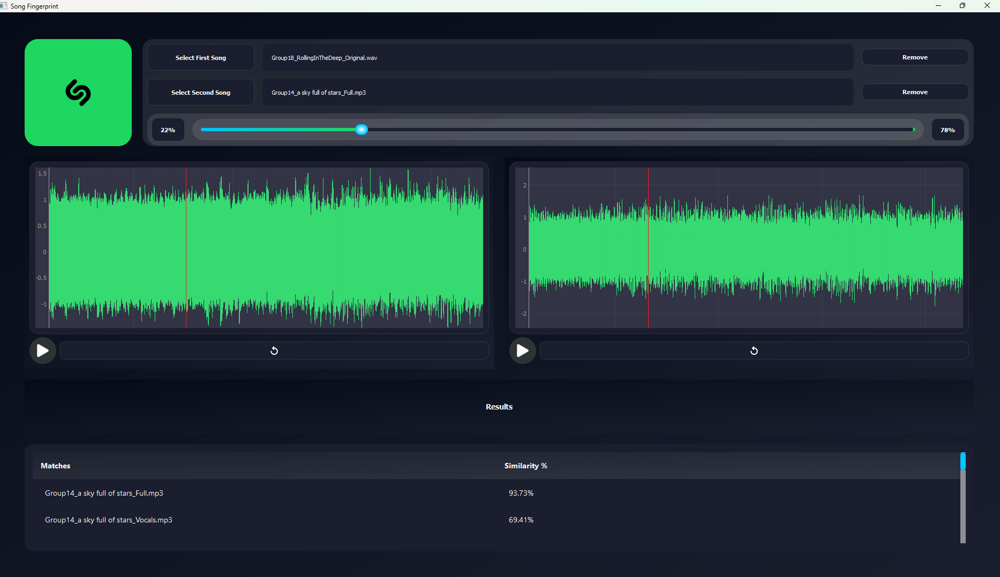

# Fingerprint (Shazam-like App)

## Introduction

This project is a **signal fingerprinting application** inspired by Shazam. The goal is to identify a signal (e.g., a song, music track, or vocals) based on its unique intrinsic features. This technique is widely applicable, from identifying music tracks to diagnosing arrhythmias in ECG signals.

---

## Features

1. **Song Repository Creation**:
   - Songs are separated into music and vocals using external tools.
   - Files are named in the format:
     - `GroupX_SongNameOrSinger_Full`
     - `GroupX_SongNameOrSinger_Music`
     - `GroupX_SongNameOrSinger_Vocals`

2. **Spectrogram Generation**:
   - Automatically generates spectrograms for the first **30 seconds** of the song, music, and vocals.
   - Spectrogram files are saved locally.

3. **Feature Extraction**:
   - Extracts key features from spectrograms.
   - Uses perceptual hash functions to create unique fingerprints.

4. **Similarity Matching**:
   - Matches a given sound file (song, vocals, or music) against the repository.
   - Outputs a sorted list of similar songs based on a similarity index.

5. **Weighted Mixing**:
   - Combines two sound files with a **weighted average** (slider to adjust weighting).
   - Treats the resulting mix as a new file for similarity matching.

6. **Graphical User Interface (GUI)**:
   - Displays similarity results in a neat, sortable table.
   - Interactive sliders for controlling file mixing.

---

## Usage Instructions

 1. **Generate Spectrograms**
- Run the program to iterate over all files in the shared folder.
- It generates spectrograms for:
  - Full song
  - Music
  - Vocals
- Saves spectrograms and extracted features locally.

 2. **Search for Similar Songs**
- Input a song (or mix) file into the app.
- The program generates its fingerprint and compares it to the repository.
- A sorted table of similar songs and their similarity indices is displayed.

 3. **Mix Two Files**
- Select two files and adjust the slider for weighting.
- Treat the resulting mix as a new file for similarity matching.

---

## Notes

- The project focuses on **perceptual hashing** for better recognition.
- The first 30 seconds of each song are used to standardize computation.
- GUI sliders allow intuitive control over file mixing.

---
#### **Demo**
https://github.com/user-attachments/assets/32582291-1c0d-40ed-97d5-5f8d929d3cbd

## Example Workflow

1. **Upload Files**:
   - Add your group's song to the shared repository after separation.
2. **Generate Features**:
   - Extract features and hash them.
3. **Search Similarity**:
   - Input a query file and view the similarity results.
4. **Mix and Search**:
   - Combine two files, create a mix, and find similar songs.

